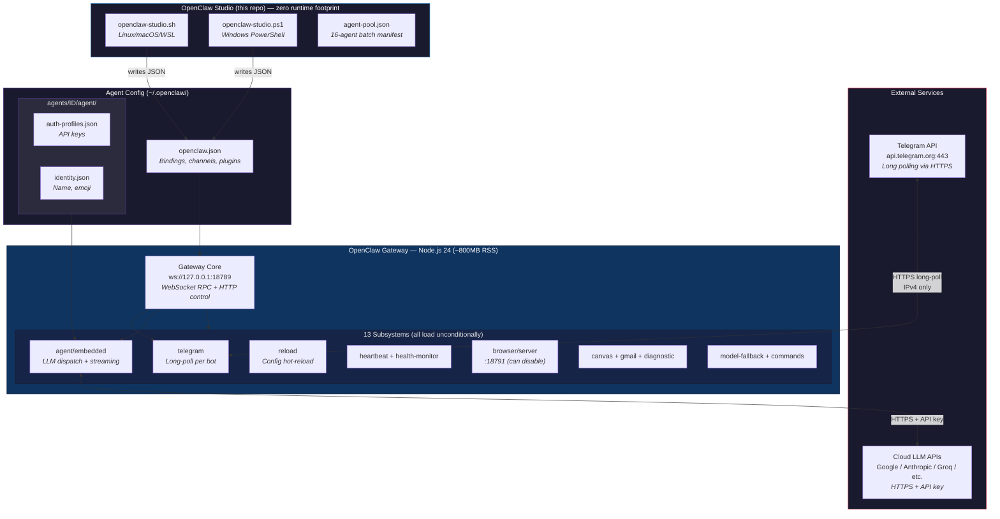
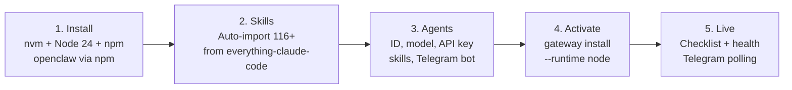

```
 ██████╗ ██████╗ ███████╗███╗   ██╗ ██████╗██╗      █████╗ ██╗    ██╗
██╔═══██╗██╔══██╗██╔════╝████╗  ██║██╔════╝██║     ██╔══██╗██║    ██║
██║   ██║██████╔╝█████╗  ██╔██╗ ██║██║     ██║     ███████║██║ █╗ ██║
██║   ██║██╔═══╝ ██╔══╝  ██║╚██╗██║██║     ██║     ██╔══██║██║███╗██║
╚██████╔╝██║     ███████╗██║ ╚████║╚██████╗███████╗██║  ██║╚███╔███╔╝
 ╚═════╝ ╚═╝     ╚══════╝╚═╝  ╚═══╝ ╚═════╝╚══════╝╚═╝  ╚═╝ ╚══╝╚══╝
          ─────────────  S T U D I O  ─────────────  v 5.3.0
```

> **Thin config layer for OpenClaw** — writes JSON presets, calls the CLI, and gets out of the way. Cloud models only. No local inference, no RAM bloat from this repo.

  

---

## Architecture



### Layer Breakdown

| Layer | Component | Role | Memory |
|---|---|---|---|
| **Gateway** | `openclaw-gateway` (Node.js 24) | Single long-running process hosting all subsystems, WebSocket RPC on `:18789` | **~800MB RSS** |
| **Channel** | `telegram` subsystem | Long-polls Telegram API per bot account; dispatches inbound messages to bound agent | Shared with gateway |
| **Agent Runtime** | `agent/embedded` | Receives messages from channels, constructs LLM prompt with skills/persona, calls cloud model, streams response back | Shared with gateway |
| **Model Provider** | Cloud LLM API | Actual inference — Google, Anthropic, Groq, etc. via HTTPS | **0MB local** |
| **Skills** | `.md` files in openclaw skills dir | Injected into agent system prompt — define capabilities and behavior patterns | Disk only |
| **Studio Scripts** | `openclaw-studio.sh` / `.ps1` | Thin config writer — writes JSON, calls CLI, not resident | **0MB** |

### What Loads at Startup (all of it, always)

| Subsystem | Purpose | Can Disable? |
|---|---|---|
| `gateway` | Core RPC + HTTP server | No — required |
| `telegram` | Telegram bot polling | No — required for Telegram |
| `agent/embedded` | LLM dispatch | No — required for responses |
| `reload` | Config hot-reload | No — built-in |
| `heartbeat` | Health ping | No — built-in |
| `health-monitor` | Interval health checks (300s) | No — built-in |
| `commands` | Slash command registry | No — built-in |
| `model-fallback` | Auto-retry on provider errors | No — built-in |
| `diagnostic` | Error reporting | No — built-in |
| `browser/server` | Browser automation on `:18791` | Yes — `openclaw config set browser.enabled false` |
| `canvas` | Static file hosting | No — built-in (minimal) |
| `gmail-watcher` | Email polling | Auto-off if not configured |

---

## Memory & Performance

### Baseline (cloud models, no local inference)

| Process | RSS | Notes |
|---|---|---|
| `openclaw-gateway` | **~800MB** | Node.js 24, 13 subsystems loaded unconditionally |
| **Studio scripts** | **0MB** | Not resident — runs only during setup |
| **Cloud LLM calls** | **0MB local** | Inference happens on provider servers |

### Why Is the Gateway ~800MB?

OpenClaw's gateway is a **monolithic Node.js process**. It loads all 13 subsystems at startup regardless of what you use. There is no way to selectively load only Telegram polling — browser automation, canvas, gmail watcher, health monitor, command registry, etc. all load unconditionally.

**This is OpenClaw's architecture, not something Studio can fix.** Studio is a thin config writer — it writes JSON presets and calls `openclaw` CLI commands. The ~800MB is the cost of OpenClaw's orchestration layer.

> **Do NOT cap Node.js heap** via `NODE_OPTIONS=--max-old-space-size=512` — the gateway needs ~700MB just to boot. A 512MB cap causes infinite OOM → crash → restart loops, which is *worse* for RAM.

### Optional Tweaks

```bash
# Disable browser automation subsystem (saves some GC pressure)
openclaw config set browser.enabled false

# Reduce concurrent agent runs
openclaw config set agents.defaults.maxConcurrent 1
openclaw config set agents.defaults.subagents.maxConcurrent 2
```

---

## Features

- **Thin config writer** — writes `openclaw.json`, `auth-profiles.json`, calls CLI, zero runtime footprint
- **Cloud-only** — 7 providers (Google, Groq, Zhipu, Anthropic, OpenAI, OpenRouter, DeepSeek), no local inference
- **Native CLI integration** — verified against OpenClaw 2026.3.12 (`agents add`, `channels add`, `gateway install`)
- **Multi-agent wizard** — interactive: ID, name, persona, model, API key, skills, Telegram bot + allowlist
- **Telegram per-agent bots** — each agent gets its own `@BotFather` token with DM allowlist control
- **Service persistence** — `openclaw gateway install` registers systemd (Linux) or Task Scheduler (Windows)
- **agent-pool.json** — deploy 16 pre-configured specialist agents from a single JSON file
- **116+ skills** — auto-imported from [everything-claude-code](https://github.com/affaan-m/everything-claude-code) during install
- **Live checklist** — post-activation dashboard showing gateway, agents, Telegram channels, service status

---

## Quick Start

```bash
git clone https://github.com/bufferring/openclaw-studio.git
cd openclaw-studio

# Linux / macOS / WSL
chmod +x openclaw-studio.sh
./openclaw-studio.sh

# Windows (PowerShell)
Set-ExecutionPolicy RemoteSigned -Scope CurrentUser
.\openclaw-studio.ps1
```

Direct CLI flags:

```bash
./openclaw-studio.sh install    # Install OpenClaw + dependencies
./openclaw-studio.sh agents     # Manage agents
./openclaw-studio.sh activate   # Start gateway + show checklist
./openclaw-studio.sh checklist  # Show live status
./openclaw-studio.sh health     # Run health check
```

---

## Setup Workflow



| Step | What Happens | Files Touched |
|---|---|---|
| **1. Install** | nvm → Node 24, `npm install -g openclaw`, system deps (curl, git, jq) | — |
| **2. Skills** | Clones `everything-claude-code`, copies `skills/*` into openclaw's global skills dir | `~/.nvm/.../openclaw/skills/` |
| **3. Agents** | Interactive wizard per agent: model, API key, Telegram token, allowlist | `openclaw.json`, `auth-profiles.json` |
| **4. Activate** | `openclaw gateway install --runtime node`, registers systemd/schtasks, starts polling | `~/.config/systemd/user/openclaw-gateway.service` |
| **5. Live** | Checklist shows green/red for gateway, agents, Telegram, service status | stdout |

### Per-Agent Setup (Option 3)

```
Agent ID       →  unique slug (e.g. "shuru")
Display Name   →  shown in Telegram and identity
Model          →  provider/model  (e.g. google/gemini-2.0-flash)
API Key        →  stored in ~/.openclaw/agents/<id>/agent/auth-profiles.json
Skills         →  pick from installed skills list
Bot Token      →  from @BotFather
Allowed IDs    →  Telegram user IDs (comma-separated), or * for open
```

---

## Model Providers

| Provider | Default Model | Tier | Env Var |
|---|---|---|---|
| **Google** ★ | `gemini-2.0-flash` | Free tier | `GOOGLE_API_KEY` |
| **Groq** | `llama-3.3-70b-versatile` | Free tier | `GROQ_API_KEY` |
| **ZAI / Zhipu** | `glm-4.7-flash` | Free tier | `ZAI_API_KEY` |
| **Anthropic** | `claude-sonnet-4-6` | Paid | `ANTHROPIC_API_KEY` |
| **OpenAI** | `gpt-4o` | Paid | `OPENAI_API_KEY` |
| **OpenRouter** | `anthropic/claude-sonnet-4` | Multi | `OPENROUTER_API_KEY` |

★ Recommended default — free tier, fast, zero local RAM. DeepSeek available via `openrouter/deepseek/`.

---

## Agent Pool (`agent-pool.json`)

16 pre-configured specialist agents. Deploy all at once with option 4:

| Agent | Skills | Role |
|---|---|---|
| `orchestrator` | chief-of-staff | Task routing |
| `planner` | planner, blueprint, strategic-compact | Planning |
| `python-dev` | python-patterns, python-testing | Python |
| `go-dev` | golang-patterns, golang-testing | Go |
| `java-dev` | java-coding-standards, springboot-* | Java/Spring |
| `kotlin-dev` | kotlin-coroutines-flows | Kotlin |
| `swift-dev` | swiftui-patterns, swift-concurrency-6-2 | Swift/iOS |
| `django-dev` | django-patterns, django-security | Django |
| `frontend-dev` | frontend-patterns | Frontend |
| `devops` | docker-patterns, deployment-patterns | DevOps |
| `security` | security-review, security-scan | Security |
| `android-dev` | android-clean-architecture | Android |
| `architect` | architect, api-design, backend-patterns | Architecture |
| `reviewer` | code-reviewer, refactor-cleaner | Code review |
| `tdd-guide` | tdd-guide, e2e-testing | Testing |
| `agent-ops` | agentic-engineering, continuous-learning | Agent Ops |

All default to `google/gemini-2.0-flash`. Override per-agent in the JSON.

---

## Project Structure

```
openclaw-studio/                          # THIS REPO — setup scripts only
├── openclaw-studio.sh                    # Linux / macOS / WSL setup (bash)
├── openclaw-studio.ps1                   # Windows PowerShell setup
├── agent-pool.json                       # 16-agent batch deployment manifest
├── agents/                               # Agent persona definitions (.md)
│   ├── orchestrator.md
│   ├── python-dev.md
│   └── ...                               # One .md per agent persona
├── .gitignore
├── LICENSE
└── README.md
```

**Runtime state** (generated by OpenClaw + scripts, not committed):

```
~/.openclaw/                              # OPENCLAW HOME — all runtime state
├── openclaw.json                         # Master config (agents, bindings, channels, plugins)
├── agents/
│   └── <id>/
│       ├── agent/
│       │   ├── auth-profiles.json        # API keys {version:1, profiles:{...}}
│       │   └── identity.json             # Display name + emoji
│       └── sessions/                     # Conversation history per chat
├── workspace/<id>/                       # Agent file workspace
├── canvas/                               # Canvas static files (served by gateway)
├── status.md                             # Last checklist output
└── backup/                               # Config backups (timestamped)

~/.config/systemd/user/                   # LINUX SERVICE
└── openclaw-gateway.service              # systemd user unit (Node 24, port 18789)

~/.nvm/versions/node/v24.x.x/            # NODE.JS RUNTIME
└── lib/node_modules/openclaw/
    ├── dist/index.js                     # Gateway binary
    └── skills/                           # 116+ imported skill definitions
```

---

## Telegram Setup

1. Create a bot via [@BotFather](https://t.me/BotFather) → copy the token
2. Get your Telegram user ID: `./openclaw-studio.sh` → option **8**, or message [@userinfobot](https://t.me/userinfobot)
3. Add both when prompted during agent creation (option 3)

The script runs:
```bash
openclaw plugins enable telegram
openclaw channels add --channel telegram --token <TOKEN> --account <ID> --name <NAME>
openclaw config set channels.telegram.accounts.<ID>.allowFrom '[88885811]'
openclaw config set channels.telegram.accounts.<ID>.dmPolicy allowlist
openclaw agents add <ID> --model <MODEL> --workspace <DIR> --bind telegram:<ID>
```

---

## Service Persistence

### Linux (systemd user unit)
```bash
# Installed automatically by 'Activate Agents'
openclaw gateway install --runtime node
systemctl --user status openclaw-gateway.service
journalctl --user -u openclaw-gateway.service -f   # live logs
```

### Windows (Task Scheduler)
```powershell
openclaw gateway install --runtime node
Get-ScheduledTask "OpenClaw Gateway"
```

---

## Troubleshooting

### Telegram bot not responding

**Symptom:** Gateway logs show `deleteWebhook failed: Network request failed` or `fetch failed` on repeat.

**Cause:** Broken IPv6 routes. Node.js `undici` tries IPv6 first; if your ISP/router doesn't route IPv6 to Telegram's servers, fetch hangs until timeout.

**Fix (Linux):**
```bash
# Prefer IPv4 in getaddrinfo (recommended)
echo 'precedence ::ffff:0:0/96  100' | sudo tee -a /etc/gai.conf

# Or disable IPv6 entirely (nuclear option)
sudo sysctl -w net.ipv6.conf.all.disable_ipv6=1
echo 'net.ipv6.conf.all.disable_ipv6 = 1' | sudo tee -a /etc/sysctl.conf
```

**Fix (Windows):**
```powershell
netsh interface ipv6 set state disabled
```

### Gateway eating ~800MB RAM

**Cause:** OpenClaw loads 13 subsystems unconditionally into a single Node.js process. This is OpenClaw's monolithic architecture — not a Studio bug.

**Do NOT** try to cap the heap with `NODE_OPTIONS=--max-old-space-size=512`. The gateway needs ~700MB to boot. A 512MB cap causes infinite OOM → crash → restart loops.

**Minor savings:**
```bash
openclaw config set browser.enabled false
openclaw config set agents.defaults.maxConcurrent 1
openclaw config set agents.defaults.subagents.maxConcurrent 2
systemctl --user restart openclaw-gateway.service
```

---

## Requirements

| Requirement | Notes |
|---|---|
| **OS** | Linux (Debian/Ubuntu/Parrot/Arch), macOS, Windows |
| **Node.js** | **24+** via nvm (Linux/macOS) or winget (Windows) |
| **npm** | Comes with Node.js 24 — used for `npm install -g openclaw` |
| **OpenClaw** | 2026.3.8+ |
| **jq** | Required for JSON operations (`apt install jq`) |
| **git** | Required for skills import |
| **API key** | At least one cloud provider key (Google free tier recommended) |
| **RAM** | ~1GB for gateway; no local inference overhead |

---

## Changelog

### v5.3.0
- **Renamed:** Scripts `openclaw-setup.*` → `openclaw-studio.*`
- **Fixed:** ALL provider model IDs verified against OpenClaw 2026.3.12 catalog
- **Fixed:** Provider `zhipu` → `zai` (matches OpenClaw's actual provider name)
- **Fixed:** Groq models need full suffixes (`llama-3.3-70b-versatile`, not `llama-3.3-70b`)
- **Fixed:** Anthropic models need version suffixes (`claude-sonnet-4-6`, not `claude-sonnet-4`)
- **Fixed:** OpenAI models updated (`gpt-4.1` replaces deprecated `gpt-3.5-turbo`)
- **Removed:** DeepSeek as direct provider (not in OpenClaw catalog — use `openrouter/deepseek/`)
- **Fixed:** Group chat enabled by default — `groupPolicy` + `groupAllowFrom` set alongside `dmPolicy`
- **Added:** Group policy option in edit agent menu
- **Improved:** Skills import validates discovery after copy
- **Fixed:** `gateway.mode=local` seeded on fresh install (prevents crash-loop)
- **Fixed:** List/edit/delete agents use OpenClaw CLI as primary source (not just local `agents.json`)
- **Fixed:** Doctor warnings no longer break agent listing
- **Removed:** `bun` from health check (dropped in v5.1.0)
- **Cleanup:** Removed dead code (`spinner`, stale comments, redundant vars)

### v5.2.0
- **Breaking:** Dropped local model (Ollama) support entirely — **cloud providers only**
- **Removed:** `install_ollama`, `ensure_ollama_running`, `recommend_context_window`, `write_models_json` and all PS1 equivalents
- **Removed:** `models.json` generation, context window prompts, Ollama dynamic model listing
- **Removed:** Ollama from provider lists, health checks, checklists, install menu
- **Architecture:** Studio is now a thin config writer — writes JSON presets, calls CLI, done
- **Default:** `google/gemini-2.0-flash` (free tier, zero local RAM)
- **Warning:** Do NOT cap Node.js heap — 512MB causes OOM crash loops. Gateway needs ~700MB to boot.

### v5.1.0
- Dropped bun — Node.js 24 + npm only
- IPv6 fix for Telegram connectivity
- Skills auto-imported from `everything-claude-code` during install
- `auth-profiles.json` merge instead of overwrite

### v5.0.0
- Telegram plugin fix, allowFrom, auth-profiles, gateway persistence
- Live checklist, status output, `agent-pool.json` v2.0
- All 16 agents default to `google/gemini-2.0-flash`

---

## License

MIT — see [LICENSE](./LICENSE)
