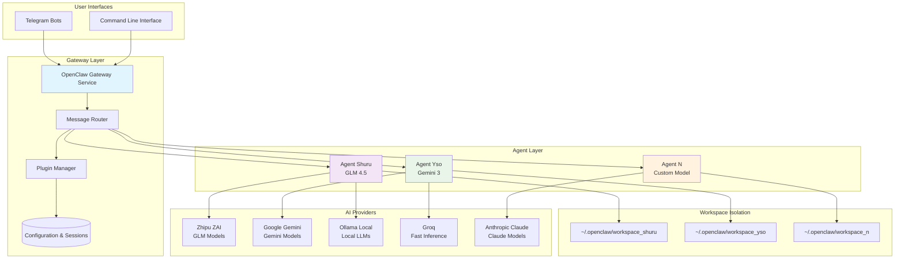

# OpenClaw Studio - Multi-Agent Orchestrator

```text
  ___                 ___ _             ___ _           _ _     
 / _ \ _ __  ___ _ _ / __| |__ _ __ __ / __| |_ _  _ __| (_)___ 
| (_) | '_ \/ -_) ' \ (__| / _' |\ V  V /\__ \  _| || / _` | / _ \
 \___/| .__/\___|_||_\___|_\__,_| \_/\_/ |___/\__|\_,_\__,_|_\___/
      |_|                                                       
```
OpenClaw Studio is an advanced configuration and orchestration system for OpenClaw deployments, specifically optimized for Parrot OS, Debian, and other Linux environments. It allows for the seamless setup of multiple autonomous agents, each with its own workspace, identity, and AI model.

## 🚀 Version 1.3.0 Features

- **Multi-Agent Setup:** Configure multiple agents (Shuru, Yso, etc.) with unique personas.
- **State Recovery & Resumption:** If the setup is interrupted, it can pick up exactly where it left off.
- **Persona Templates:** Choose from Developer, Researcher, DevOps, or General Assistant personas to auto-generate agent identities.
- **Ollama Integration:** Full support for local LLMs with automatic GPU acceleration detection (NVIDIA/AMD).
- **Security First:** Aggressive permission hardening and sensitive token masking.
- **Telegram Validation:** Real-time validation of Bot tokens before applying configuration.
- **Persistence:** Automatic systemd service generation with lingering enabled for 24/7 uptime.

## 🛠️ Installation

1. Clone this repository:
   ```bash
   git clone https://github.com/your-repo/openclaw-studio.git
   cd openclaw-studio
   ```

2. Run the setup script:
   ```bash
   bash openclaw-setup.sh
   ```

3. Follow the TUI prompts to configure your agents.

## 📁 Project Structure

- `openclaw-setup.sh`: The core orchestration script.
- `docs/ARCHITECTURE.md`: Technical details and system diagrams.
- `backups/`: Automatic backups of previous configurations.

## 🏗️ Architecture Overview



### Key Components

- **Gateway Service**: Central routing and orchestration layer
- **Agent Isolation**: Each agent runs in its own workspace with unique identity
- **Multi-Provider Support**: Integration with major AI providers and local models
- **Security & Persistence**: Systemd services with 24/7 uptime and secure token management

## 📝 License

This project is licensed under the [MIT License](LICENSE).
